# FTU Segmentation on HPA Dataset Pretrained on MRI Lower-grade Giloma Tumor Scans

Cell Segmentation of FTU pretrained on MRI scans using UNet.

## Steps

**SETUP**

Download dataset and create file directories.

```
./set_up.sh
```

Pretrain with MRI Dataset

Ex.

```
python3 train_mri.py --description "MRI-Pretrain" --IMG_SIZE 256 --BATCH-SIZE 16 --SPLIT [0.8, 0.1, 0.1] --EPOCHS 500 --MRI_LEARNING_RATE 0.01 --OPTIMIZER "adam"
```

Use pretrained MRI model to train on HPA dataset.

Ex.

```
python3 train_hpa.py --description "HPA-Training" --mri_pretrain True --image-tiling True --IMG_SIZE 256 --BATCH-SIZE 16 --SPLIT [0.8, 0.1, 0.1] --EPOCHS 500 --HPA_LEARNING_RATE 0.01 --OPTIMIZER "adam"
```

**Magnetic Resonance Imaging scans used for pretraining**

Lower-grade glioma tumors are marked as green areas.

<a href="https://www.sciencedirect.com/science/article/abs/pii/S0010482519301520">Original Paper</a>

<p float="left">
  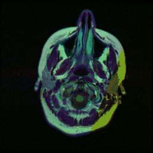
  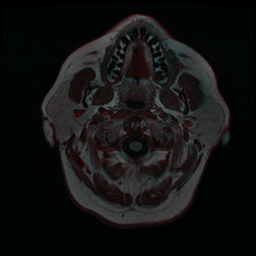 
  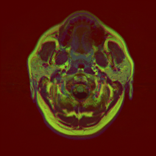
  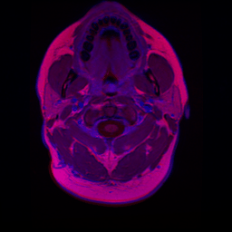
  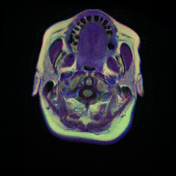
  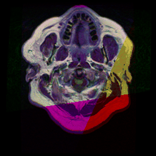
</p>

**RESULTS**

## MRI Scans

Given that many images do not have masks, those that have a label had a dice score of above 0.7.


# Loss Functions and Metrics

It was important for the model to detect small functional tissue units since the size of the regions varied across different organs. Additionally, false positive labels would confuse the researchers and make the model less trustworthy.

This motivated the focal + dice loss function.

- The focal loss was an improvement upon the cross entropy loss by weighing hard (low probability) misclassified examples more. The additional dice loss attaches similiar importance to false positives and false negatives, which help overcome the data imbalance.

For the metrics, f1 score, and dice score were used as the metrics.

- F1 score was monitored to monitor the balance between precision (P(Y=1 | Y^=1)) and recall (P(Y^=1 | Y=1).
- The dice score was used to determine the overall model performance since it is a pixel-wise score.

## HPA Dataset

## Focal + Dice Loss

  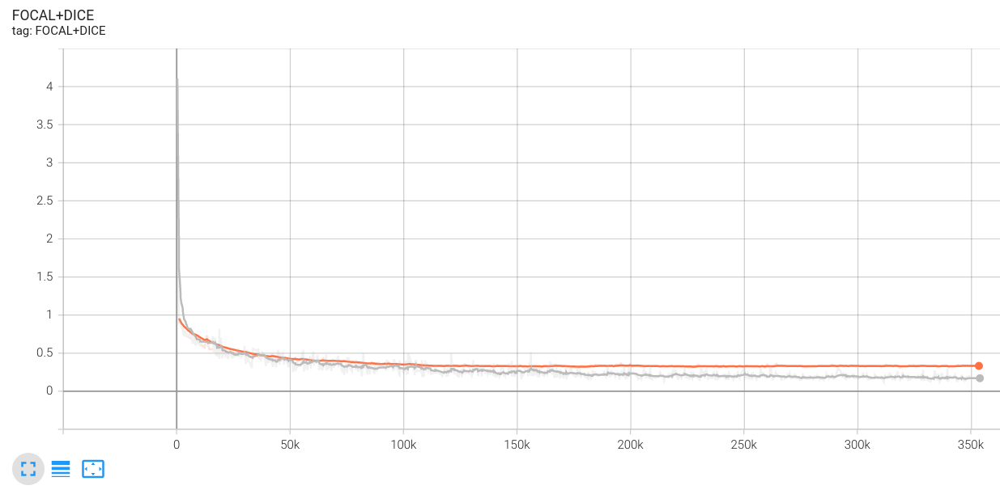

## Dice Loss

  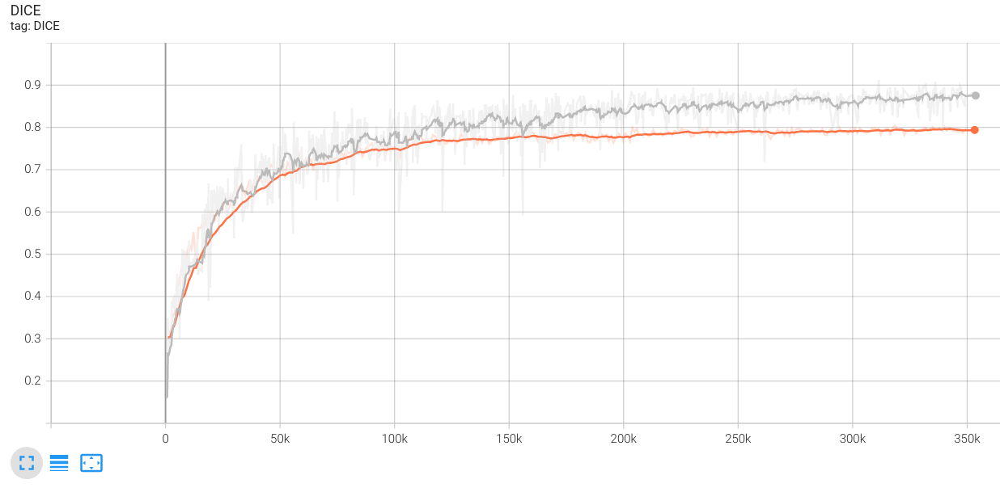
<br/>
<br/>
<br/>
<br/>

## Train and Validation Without Image Tiling Predicted

Both training and validation fail to segment smaller objects, especially in lung cancers, where no predictions were made.

<p float="left">
  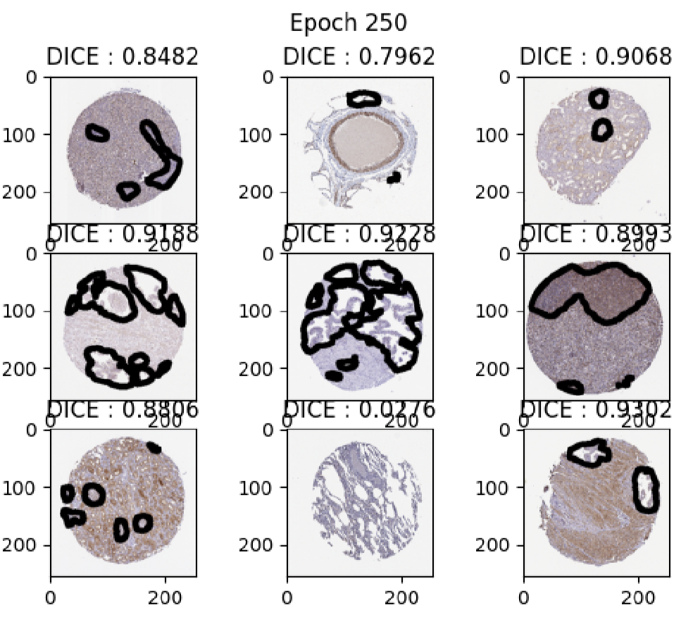
  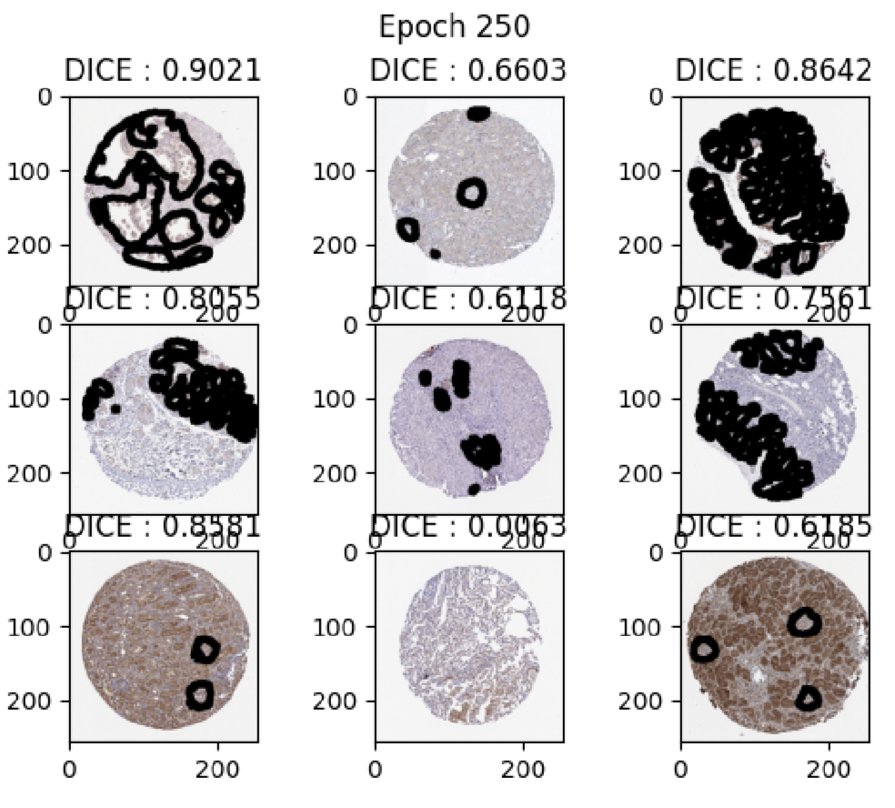
</p>

## Image Tiling


## Test Original and Prediction With Image Tiling

Although segmentations on smaller objects were made, there were some false postiive labels.

<p float="left">
  <h3>Original</h3>
  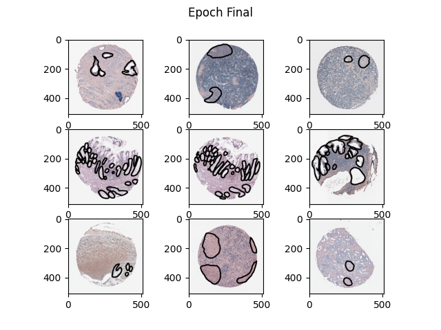
  <h3>Predicted</h3>
  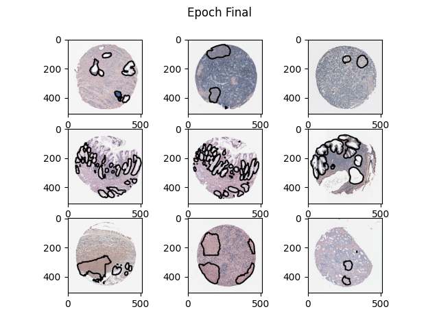
</p>
